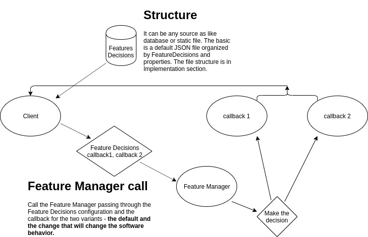

<h1 align="center">Smile-Toggle</h1>
<h3 align="center"><b>Smile-Toggle is a library</b> that apply a strategy pattern that allows applications switch their behavior from a simple and external configurable source.</h3>

# Motivation

[Martin Fowler Article](https://martinfowler.com/articles/feature-toggles.html)

This project is a straightforward Javascript implementation of the Strategy Pattern introduced by Margin Fowler for Feature Flags. It aims to empower an Javascript architeture to the use of Feature Toggles easily and standardized.

# Give it a try

Clone this repo, switch to the client folder and run `node index.js`. You will see the callback being called based on the decisions rules file.

# Flow


# Getting started

The first step is to install the library:

    npm i smile-toggle --save

## Implementation

1. Create a Feature Decision file, following the pattern:
    ```json
    {
        "featureName": {
            "activated": false,
            "expiration": "2019-12-31",
            "group": "dev"
        }
    }
    ```
1. Import the library and instantiate it passing the FeaturesDecisions configuration file:
    ```javascript
    const FeatureDecisions = require('./FeaturesDecisions.json')
    const smileToggle = require('smile-toggle')(FeatureDecisions)
    ```
1. Create the callbacks:
    ```javascript
    const FeatureDecisions = require('./FeaturesDecisions.json')
    const smileToggle = require('smile-toggle')(FeatureDecisions)

    class HelloFeatureStrategy {
        constructor() {
        }

        defaultBehavior() {
            console.log('Default behavior kept')
        }

        changeDefaultBehavior() {
            console.log('Changed the component behavior')
        }
    }
    ```
1. Call the Feature Manager smile-toggle passing through the **default** and **changer** callback:
    ```javascript
    const FeatureDecisions = require('./FeaturesDecisions.json')
    const smileToggle = require('smile-toggle')(FeatureDecisions)

    class HelloFeatureStrategy {
        constructor() {
            smileToggle.shouldShowUserHomePage(
                this.defaultBehavior,
                this.changeDefaultBehavior
            )
        }

        defaultBehavior() {
            console.log('Default behavior kept')
        }

        changeDefaultBehavior() {
            console.log('Changed the component behavior')
        }
    }

## LICENSE

MIT License

Copyright (c) 2018 Lucas Costa

Permission is hereby granted, free of charge, to any person obtaining a copy
of this software and associated documentation files (the "Software"), to deal
in the Software without restriction, including without limitation the rights
to use, copy, modify, merge, publish, distribute, sublicense, and/or sell
copies of the Software, and to permit persons to whom the Software is
furnished to do so, subject to the following conditions:

The above copyright notice and this permission notice shall be included in all
copies or substantial portions of the Software.

THE SOFTWARE IS PROVIDED "AS IS", WITHOUT WARRANTY OF ANY KIND, EXPRESS OR
IMPLIED, INCLUDING BUT NOT LIMITED TO THE WARRANTIES OF MERCHANTABILITY,
FITNESS FOR A PARTICULAR PURPOSE AND NONINFRINGEMENT. IN NO EVENT SHALL THE
AUTHORS OR COPYRIGHT HOLDERS BE LIABLE FOR ANY CLAIM, DAMAGES OR OTHER
LIABILITY, WHETHER IN AN ACTION OF CONTRACT, TORT OR OTHERWISE, ARISING FROM,
OUT OF OR IN CONNECTION WITH THE SOFTWARE OR THE USE OR OTHER DEALINGS IN THE
SOFTWARE.